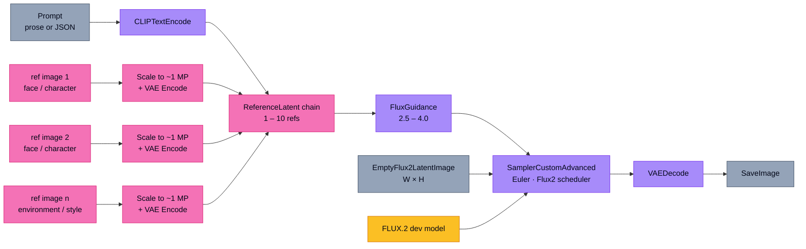

# FLUX.2 Prompt Guide

A reference manual for AI art directors building cinematic horror and thriller sequences in ComfyUI with **FLUX.2 [dev]** (Black Forest Labs, released 25 November 2025). FLUX.2 is not a successor to SDXL or FLUX.1 in degree but in kind: it is a **rectified-flow transformer driven by a 24-billion-parameter vision-language model**, and the prompting habits that worked on tag-trained CLIP models actively hurt it. This guide distills the official BFL prompting documentation, the ComfyUI built-in node reference, the Kontext architecture paper, and battle-tested community practice into six sections covering philosophy, hierarchy, technical precision, bias control, the native ReferenceLatent workflow, and a master template. Where community lore conflicts with documented behavior — particularly around lighting and latent injection — that conflict is flagged in plain language rather than papered over.

**Contents** — [1. The FLUX.2 philosophy](#1-the-flux2-philosophy) · [2. The hierarchical prompt structure](#2-the-hierarchical-prompt-structure) · [3. Technical precision in typography, color, and camera language](#3-technical-precision-in-typography-color-and-camera-language) · [4. Controlling geometry, lighting, and bias](#4-controlling-geometry-lighting-and-bias) · [5. The native ReferenceLatent workflow](#5-the-native-referencelatent-workflow) · [6. Master prompt template](#6-master-prompt-template) · [Conclusion](#conclusion)

See also: [**Appendix — LLM operator prompt**](appendix/operator-prompt.md) (the working agent setup used to apply this guide) · [**Examples**](examples/) (worked prompt + image pairs, coming soon)

---

## 1. The FLUX.2 philosophy

**FLUX.2 is a rectified-flow transformer, not a denoising diffusion model.** Where SD 1.5 and SDXL learned to predict the noise added to a latent at each step along a stochastic curved trajectory, FLUX.2 learns a **velocity field along a near-straight ODE path** between pure noise and the target image. This is the same family as Stable Diffusion 3, but FLUX.2 scales it to a 32B-parameter MM-DiT backbone composed of 8 double-stream blocks plus 48 single-stream blocks, with roughly 73% of parameters concentrated in the single-stream half. The practical consequence: FLUX.2 reaches a coherent image in 28–50 sampling steps rather than the 80–150 a comparable DDPM model would need, and it benefits from Euler-style ODE solvers rather than the DPM++/DDIM samplers that dominated the SD era.

**Negative prompts do not work in FLUX.2, and the reason is architectural rather than stylistic.** FLUX.2 [dev] is a **guidance-distilled** model. Unlike standard classifier-free guidance, which runs two forward passes per step (one conditional on the prompt, one unconditional) and subtracts them to amplify prompt-aligned features, the distilled variant collapses the unconditional pathway into the model itself and accepts the guidance scale as a learned input embedding. There is no second forward pass to attach a negative embedding to. Black Forest Labs' official prompting guide states this directly: **"FLUX.2 does not support negative prompts. Always describe what you want, not what you want to avoid."** Worse, English negation actively backfires — the Mistral encoder reads "a person without glasses" as semantically loaded with the word "glasses" and frequently renders them anyway. The community workarounds (Dynamic Thresholding, Perpendicular Negative Guidance, the FluxPseudoNegative ComfyUI node) all double or triple inference time and were validated on FLUX.1; they are architecturally compatible with FLUX.2 but have not been independently verified at scale on the new checkpoint as of May 2026.

**The text encoder is the second discontinuity from prior models, and it explains why Danbooru tags fail.** FLUX.1 used a dual T5-XXL plus CLIP-L stack. FLUX.2 dropped both and ships a single **Mistral-Small-3.2-24B-Instruct-2506** vision-language model as its text encoder, with intermediate-layer embeddings stacked rather than just the final layer. Mistral is an instruction-tuned LLM trained on prose; it has never seen a comma-separated Danbooru tag list as a primary distribution and treats one as poorly-structured English. The SDXL emphasis syntax `(word:1.5)` and `++` token weighting are silently ignored — they are not parsed. **Write in clear, declarative sentences.** Place the most important information first; the model demonstrably weights earlier tokens more heavily. The hard prompt limit in the official Diffusers `Flux2Pipeline` is **512 tokens**, with BFL recommending a **30–80 word sweet spot** for most work. Marketing claims of a "32K-token prompt window" circulating in third-party blogs conflate Mistral's underlying context window with the inference pipeline limit and should be ignored.

The takeaway is simple. Stop subtracting. Stop tagging. Stop weighting. **Describe the image you want, in the order a director would describe a shot, in fewer than 80 words.**

## 2. The hierarchical prompt structure

The seven-stage **Scene → Subject → Action → Lighting → Camera → Style → Mood** order popular in community guides is a useful operational shorthand, but the canonical BFL framework is the four-element **Subject + Action + Style + Context**. Both work, and they are reconcilable: the seven-stage version simply unpacks Context into Lighting, Camera, and Mood, and adds a leading Scene block when the environment carries narrative weight. For cinematic horror and thriller work, the longer order is generally superior because the genre depends on environmental atmosphere existing before the subject is revealed. Black Forest Labs' own JSON prompting schema — with top-level keys for `scene`, `subjects`, `style`, `color_palette`, `lighting`, `mood`, `background`, `composition`, and `camera` — closely mirrors this expanded ordering.

**Scene** establishes the place, time, and weather before any human enters: "*A derelict logging chapel deep in the Schwarzwald at 3 a.m., dense fog clinging to ancient firs, intermittent moonlight through cloud breaks.*" **Subject** introduces the figure with concrete identity and physical description rather than aesthetic adjectives: "*A 47-year-old woman with hollow cheeks and grey-streaked auburn hair, wearing a soaked wool overcoat.*" **Action** specifies pose, gaze, and gesture in the present continuous: "*She stands frozen on the moss-covered stone steps, head turned slightly to the left, hands hanging open at her sides.*" **Lighting** comes next because in cinematic work lighting tells you what kind of image this is before any lens choice does — and because FLUX.2's training data clearly weighted lighting language heavily. **Camera** specifies the optics that frame all of the above. **Style** carries film stock, color grading, and visual references. **Mood** closes with the affective register the previous six elements should sum to, plus any cinematographer or movement reference.

The reason the order matters is that FLUX.2 is autoregressive in its attention bias even though it is not autoregressive in generation. Tokens that appear earlier in the prompt influence the conditioning signal more strongly. Burying your subject after fifty words of style description produces an image where style dominates and subject identity drifts. Burying your lighting in the final clause produces images where the model defaults to its trained mean — an even, slightly overexposed three-point setup that is the death of horror atmosphere. **Front-load the load-bearing elements.**

For complex, multi-character, or production-grade work, BFL explicitly endorses switching to JSON-structured prompts. The model parses them reliably and the structure prevents the prose from drifting:

```json
{
  "scene": "Derelict logging chapel, Schwarzwald, 3 a.m., heavy fog",
  "subjects": [
    {"description": "47-year-old woman, hollow cheeks, grey-streaked auburn hair, soaked wool overcoat",
     "position": "lower-left third, foreground, framed against the chapel doorway",
     "action": "frozen on stone steps, head turned slightly left, hands open at sides"}
  ],
  "lighting": "single practical sodium-vapor streetlamp camera-right, light spilling onto moss away from subject, face in soft ambient fill from fog reflection",
  "camera": {"angle": "low, slightly canted Dutch", "lens": "35mm anamorphic", "f-number": "f/2.0", "depth_of_field": "shallow, chapel softening into fog"},
  "color_palette": ["#0F1419", "#2A3439", "#8B7355", "#C9A961"],
  "style": "Cross-processed Kodak Ektachrome 64 from 1987, heavy grain, crushed blacks, halation around the streetlamp",
  "mood": "slow dread, Robert Eggers naturalism, A24 horror restraint"
}
```

## 3. Technical precision in typography, color, and camera language

FLUX.2 renders **literal text and exact colors more accurately than any prior open-weight model** — provided you signal it correctly. For text, wrap the rendered string in single or double quotes and bind it to a specific surface: *The text 'OPEN 24 HOURS' appears in red neon letters above the diner door, slightly buzzing, ultra-bold sans-serif.* Specify placement, color (ideally as hex), font weight, and an era or descriptive style. Reliable surfaces include neon signs, storefront fascias, book covers, magazine covers with multiple stacked headlines, posters, product packaging, T-shirts, screens and UI mockups, and even non-Latin scripts. Reliability degrades past four or five words per quoted block; BFL's own guide treats text as **layout guidance rather than pixel-perfect typography**, and community first-attempt accuracy on complex multi-element layouts hovers around 60% versus an internal BFL benchmark of around 92% on long-form text. Naming a specific font like "Helvetica" or "Futura" works inconsistently; describing the visual qualities ("**bold geometric sans-serif with slightly extended kerning**") works far better and is what every official BFL example uses.

For color, FLUX.2 understands hex codes directly when prefixed with the keyword `color` or `hex` and bound to an object: *terracotta walls in hex #C4725A, deep teal sectional in #1B6B6F, golden amber accent pillows in #E8A847.* Vague placements ("use #FF0000 somewhere") fail. Gradients work when you specify endpoints. Limited palettes can be specified inline or via the `color_palette` JSON array, which is the most reliable approach for brand or production work where a defined palette must persist across multiple generations. RGB tuple notation and Pantone references are not in any official BFL example and should be treated as unsupported lore. Even with hex codes, render output is **approximate rather than pixel-exact** — the model interprets hex as a strong color cue but final pixel values drift under colored lighting, so pair each critical hex with a descriptive name ("matte terracotta #C4725A") for stronger adherence.

**Professional camera language is the single highest-leverage upgrade you can make to a FLUX.2 prompt.** The model was clearly trained on a large corpus of metadata-tagged photography, and specificity dominates. Replace "professional photo" with the full chain: body, focal length, aperture, lighting, and color treatment. The following are reliably understood and are listed by both BFL and consistent community testing.

- **Stills cameras and lenses (high confidence):** Hasselblad X2D, Canon 5D Mark IV / EOS R5, Sony A7IV / A7R IV, Fujifilm X-T5, Leica M10, generic "35mm DSLR," with focal lengths from 14mm wide-angle through 24mm dramatic, 35mm natural, 50mm standard, 85mm portrait, and 100–135mm telephoto compression.
- **Cinema-specific terminology (medium-high confidence):** anamorphic lens with characteristic horizontal flare, tilt-shift miniature effect, fisheye, macro. ARRI Alexa and RED Komodo body names appear in community prompt builders but are absent from BFL's official examples; they appear to work but with less specific rendering than stills bodies.

Aperture controls depth of field across a clean spectrum — f/1.4 through f/2.8 produces shallow depth and creamy bokeh, f/4 through f/5.6 sits in the middle, and f/8 through f/16 yields landscape-style deep focus. Shot types (wide, medium, close-up, extreme close-up, over-the-shoulder, Dutch angle, low angle, bird's-eye) all behave consistently. Lighting language is equally rich: **three-point, Rembrandt, butterfly, split, rim, key, fill, chiaroscuro, practical, motivated, volumetric, god rays, golden hour, blue hour, low-key, high-key** are all reliably parsed. Color temperature works best as descriptive language ("warm Edison tungsten," "cool sodium-vapor") rather than explicit Kelvin numbers, which appear in no official example.

Film stock references are explicitly endorsed by BFL: **Kodak Portra 400** for natural-grain organic color, **Kodak Ektachrome** (often cross-processed) for 1980s editorial look, **Cinestill 800T** for tungsten-balanced halation around practical lights, **Kodak Vision3 500T** for cinematic teal-and-orange shadows, and **Ilford HP5 / Kodak Tri-X** for monochrome grain. Aesthetic-movement labels work less consistently — "film noir" and "neo-noir" are reliable, "German Expressionism" and "A24 horror aesthetic" are community lore that probably work but never appear in BFL examples and should be reinforced with descriptive substitutes ("muted earth tones, slow naturalism, 35mm film grain, restrained composition") rather than relied upon alone. Cinematographer references like "lighting in the style of Roger Deakins" carry weight because Deakins's filmography is heavily represented in training data, but treat them as flavor rather than instruction.

## 4. Controlling geometry, lighting, and bias

FLUX.2 inherits a documented set of biases from FLUX.1 and exhibits a few new ones. The most pervasive is the **center bias**: subjects are placed near the geometric center of the frame regardless of prompt, and they tend to fill the frame at portrait or medium-shot scale. The most reliable defeats are explicit composition language placed early in the prompt — "rule of thirds with subject on the left vertical," "subject framed on the far right edge," "lower-left third of frame," "off-center composition with negative space dominating the right two-thirds" — combined with the **detail-balance technique** demonstrated empirically by MyAIForce: the ratio of words spent describing the subject versus the environment directly controls how dominant and central the subject becomes. Heavy environment description with brief subject mention pushes the figure smaller and off-center; the inverse forces it to dominate. JSON `position` fields ("foreground left," "background right, partially obscured") are the most reliable composition control of all.

The **scale bias** — FLUX's tendency to render every human at portrait or medium-shot framing — yields to the same detail-balance trick supplemented by explicit shot-type vocabulary ("extreme wide shot," "establishing shot," "lone figure dwarfed by the cathedral interior"). Specific metric distances like "subject 30 meters from camera" are recommended in community prompt guides and appear to work, but rigorous A/B testing of exact-meter phrasing versus relative phrases is thin; **shot-type vocabulary plus a wide focal length (24mm or 35mm) is more empirically validated than metric distance alone**. Watch for the interaction with FLUX's strong shallow depth-of-field bias: making the background highly detailed often prompts the model to throw it heavily out of focus, blurring exactly the environmental detail you wanted to dominate. Counter this with explicit deep-focus language and an aperture specification ("f/11, deep focus from foreground to background, hyperfocal").

**Light source pointing requires positive rewriting because negation backfires.** Rather than "headlights NOT on the subject," write "*headlights pointing down the road, illuminating the wet asphalt ahead, leaving the figure in soft silhouette.*" Rather than "no harsh light on her face," write "*single sodium-vapor streetlamp camera-right, light spilling onto pavement, face in soft ambient fill from fog reflection, eyes catching only a sliver of the streetlamp's edge.*" Rim lighting, backlight, and silhouette descriptions are FLUX.2's most reliable way to keep faces dark when the scene wants them dark. The genre-critical rule for horror and thriller cinematography is to **describe what the light is doing rather than where it isn't**: where it falls, what it reflects off, what edge it kisses, what surface it leaves dark.

Hand and gesture problems remain. FLUX.2 marketing claims improved hands, and single-subject single-hand renders are roughly on par with FLUX.1 or marginally better. **Multi-person hand interactions, however, regressed at launch** — handshakes, intertwined fingers, and two-hand object grips produce extra fingers and extra arms at rates compared to "SDXL-levels of bad" by community testers. The reliable workaround is to avoid the problem rather than describe it away: **relaxed arms at sides, hands in pockets, hands clasped behind back, hand resting on a single object, hands out of frame.** Increasing sampling steps from 28 to 40 or higher and nudging guidance up by half a point helps materially. For stubborn cases, inpaint the hands at higher resolution after the rest of the image is locked.

The remaining bias inventory is worth keeping in mind because most show up uninvited in horror work. The **plastic-skin bias** that plagued FLUX.1 is reduced in FLUX.2 but still emerges at default guidance and during upscaling — defeat it by lowering guidance toward 1.5–2.0, removing words like "beautiful," "professional photo," and "high quality," and adding "**visible skin pores, fine peach fuzz, natural skin imperfections, RAW unretouched**" plus a film-stock reference. The **same-face bias** ("FLUX face") remains: faces drift toward similar features and a Western-default bone structure unless you specify ethnicity, age, and concrete physical features ("47-year-old, narrow jaw, asymmetric eyes, no chin cleft, slight gap between front teeth"). The **cleft-chin bias** persists in reduced form — explicit "smooth rounded chin, soft jawline, no chin dimple" helps partially; specifying non-Western ethnicity helps more. The **shallow depth-of-field bias** persists strongly; if you want a deep-focus horror shot of a hallway, you must state it explicitly. Finally, FLUX.2 is **CFG-sensitive** — keep guidance between 3 and 5 for [dev], and never push above 4.5 or 5 without dynamic thresholding, or you will get oversaturated or fully black outputs.

## 5. The native ReferenceLatent workflow

FLUX.2 ships with a **native multi-reference architecture** that supersedes IP-Adapter for character, product, and style consistency. The mechanism is the **ReferenceLatent** node, a built-in ComfyUI core node located under `advanced/conditioning/edit_models`. It accepts a CONDITIONING input from a text encoder and a LATENT input from a VAE-encoded reference image, and outputs a modified CONDITIONING that carries reference-latent metadata downstream. Black Forest Labs supports up to **10 simultaneous reference images per generation**, confirmed in the official launch announcement and ComfyUI's own FLUX.2 tutorial. The default workflow ships with two reference slots; additional references are added by chaining further LoadImage → ImageScaleToTotalPixels → VAE Encode → ReferenceLatent blocks in series before passing to FluxGuidance and the sampler.

The mechanism is **not** an IP-Adapter-style cross-attention injection of CLIP-vision embeddings, and it is not an arithmetic blend of latents into the noisy state. Per the FLUX Kontext paper (arXiv 2506.15742) whose mechanism FLUX.2 inherits and scales, the reference image is VAE-encoded into latent tokens, and those tokens are **concatenated as additional image tokens onto the noisy target tokens in the DiT's image stream**: `seq = [x_t ; y₁_tokens ; y₂_tokens ; …]`. Each token receives a factorized 3D RoPE positional embedding `(t, h, w)`, with the time dimension repurposed as a reference index — the target generation gets `t = 0`, the first reference gets `t = 1`, the second gets `t = 2`, and so on, allowing the joint attention layers to disambiguate which token comes from which reference while still letting all of them interact. After the final block, the reference tokens are discarded and only the target tokens go to the VAE decoder. **Identity transfer therefore happens through joint attention over concatenated latent tokens, in latent space, at the resolution of the VAE's compressed representation** — far higher fidelity than a CLIP-vision embedding could carry, which is why ReferenceLatent captures eye geometry, skin texture, garment material, and typography that IP-Adapter blurs.

There are two practical reasons ReferenceLatent supplants IP-Adapter for FLUX.2. First, **no FLUX.2-compatible IP-Adapter exists as of May 2026**, and the FLUX.1 IP-Adapter weights from XLabs and Shakker-Labs are tensor-shape-incompatible with FLUX.2's new DiT and VAE. Second, even if one were retrained, the native ReferenceLatent path benefits from the model's full 32B-parameter capacity rather than a bolted-on adapter MLP. ReferenceLatent is also distinct from FLUX.1 Redux (a separate `style_model` using sigCLIP-vision embeddings, single-image only) and is not exactly Kontext repackaged — it is the same node and same mechanism, but FLUX.2 was **trained jointly for multi-reference handling** in a way Kontext was not, gracefully accepting up to 10 references where Kontext usually handled one well and two acceptably. A unified FLUX.2 checkpoint handles text-to-image and multi-reference editing in the same model; there is **no separate "FLUX.2 Kontext" variant**.

A working ComfyUI graph for multi-character compositing looks like this:



<details>
<summary>Same graph as ASCII (for terminal viewers and LLM context dumps)</summary>

```
Load Diffusion Model (flux2_dev_fp8mixed.safetensors)
        │ MODEL
Load CLIP / mistral_3_small_flux2_bf16.safetensors
        │ CLIP
CLIPTextEncode (positive, prose or JSON)
        │ CONDITIONING
LoadImage (ref_face_1) ──► ImageScaleToTotalPixels (~1MP) ──► VAE Encode ──► LATENT_ref_1
LoadImage (ref_face_2) ──► ImageScaleToTotalPixels         ──► VAE Encode ──► LATENT_ref_2
LoadImage (ref_environment) ─► ImageScaleToTotalPixels    ──► VAE Encode ──► LATENT_ref_3
        │
CONDITIONING → ReferenceLatent(latent=LATENT_ref_1)
              → ReferenceLatent(latent=LATENT_ref_2)
              → ReferenceLatent(latent=LATENT_ref_3)
              → FluxGuidance (guidance ≈ 2.5–4.0)
              → SamplerCustomAdvanced (Euler / Flux2 scheduler)
              → VAE Decode → SaveImage
        │
EmptyFlux2LatentImage (W×H, e.g. 1280×720) feeds the sampler's latent
```

</details>

Key node-level requirements: use the new `EmptyFlux2LatentImage` (FLUX.2's VAE produces 128-channel latents, incompatible with `EmptySD3LatentImage`); use the new `flux2-vae.safetensors` (not interchangeable with FLUX.1's `ae.safetensors`); pre-crop references tightly to the subject and keep them at a consistent resolution before VAE encoding, since size mismatches between reference and target latents produce baked, over-fit textures that look unnaturally contrasty. **Reference subjects by their visual attributes in the prompt, never by index** — write "the woman with red hair next to the man in the navy overcoat," not "image 1 next to image 2." When references share strong features (two faces of similar age and ethnicity), feature mixing remains a known failure mode; separate references via chained ReferenceLatent nodes rather than stitched composites whenever character separation matters.

**One claim circulating in community guides deserves explicit flagging: that subjects injected via ReferenceLatent require soft ambient spill lighting rather than harsh direct lighting because the latent injection math causes blown-out exposures.** Extensive search of official BFL documentation, the Kontext paper, ComfyUI documentation and GitHub issues, the FLUX.2 HuggingFace model card and discussions, the Diffusers blog, and major tutorial sites turned up **no documentation supporting this claim**. What does exist in the documented record are two related but different findings. First, **mismatches between reference-latent resolution and target-latent resolution produce baked, over-contrasty artifacts** that can read as blown highlights, and the fix is to match resolutions via `ImageScaleToTotalPixels` rather than to soften lighting. Second, **multi-reference identity consistency degrades when the references have starkly different lighting and perspective**, so BFL recommends keeping reference images at similar lighting and perspective conditions when integrating them. The "soft ambient spill required by latent math" rule appears to be either anecdotal folklore or a misremembering of these two documented issues. Treat it as **unverified community lore rather than established best practice.** The mechanically grounded advice is simpler: **match reference resolution to target resolution, match the lighting of references to the lighting your final scene is supposed to have, and prompt the lighting you actually want without negation.**

## 6. Master prompt template

The following template encodes the seven-stage hierarchy in a form that can be filled in for any cinematic horror or thriller shot, with a JSON variant for production work where a defined palette and structure must persist across shots.

```
[SCENE — environment, time, weather, atmospheric conditions]
[SUBJECT — concrete identity: age, ethnicity, build, hair, distinguishing features, wardrobe; describe physically, not aesthetically]
[ACTION — present-continuous pose, gaze direction, gesture; specify hand position to avoid hand failures]
[LIGHTING — number and type of sources, direction, quality (hard/soft), what surfaces they hit, what they leave dark; describe positively, never with "not" or "no"]
[CAMERA — body, focal length, aperture, shot type, angle; e.g., "Shot on 35mm anamorphic, f/2.0, low-angle medium shot, slight Dutch tilt"]
[STYLE — film stock or color treatment, grain, halation, color grading; e.g., "Cinestill 800T, heavy halation, crushed blacks, teal shadow rolloff"]
[MOOD — affective register, optional cinematographer or movement reference; e.g., "slow dread, Robert Eggers naturalism, A24 restraint"]
[COMPOSITION — explicit framing override against center bias: "subject in lower-left third, negative space dominating right two-thirds, foreground midground background depth layering"]
[COLOR PALETTE — hex codes bound to surfaces: "fog hex #1A1F24, lamp glow hex #C9A961, skin in shadow hex #2A2520"]
```

A filled cinematic-horror example following this template, staying within BFL's recommended 30–80 word band:

> *A derelict logging chapel deep in the Schwarzwald at 3 a.m., dense fog clinging to ancient firs. A 47-year-old woman with hollow cheeks and grey-streaked auburn hair, soaked wool overcoat, frozen on moss-covered stone steps in the lower-left third of the frame, head turned slightly left, hands hanging open at her sides. Single sodium-vapor streetlamp camera-right, warm sodium light spilling onto wet pavement away from the figure, her face in soft ambient fill from fog reflection. Shot on 35mm anamorphic at f/2.0, low-angle medium-wide, slight Dutch tilt, shallow depth of field with the chapel softening into fog behind her. Cross-processed Kodak Ektachrome 64, heavy grain, halation around the streetlamp, crushed blacks, palette of #0F1419, #2A3439, #C9A961. Slow dread, Robert Eggers naturalism, A24 horror restraint.*

For production contexts, the JSON form is more reliable and easier to version-control across a sequence. The same scene rendered as JSON appears in Section 2 above and produces output with measurably tighter color and composition adherence than the prose version, at the cost of slightly less natural atmospheric drift.

---

## Conclusion

FLUX.2 rewards the discipline of a cinematographer and punishes the habits of a tag-stacker. The architecture explains both halves of that statement: a 24B-parameter Mistral VLM as the sole text encoder demands prose, the rectified-flow training objective and guidance distillation forbid negation, and the native ReferenceLatent path delivers identity transfer through joint attention over concatenated latent tokens at a fidelity that no CLIP-vision adapter can match. Three practical commitments separate adequate FLUX.2 work from genre-quality FLUX.2 work: **front-load the load-bearing element of the shot, describe lighting as something doing rather than something missing, and explicitly fight the center and shallow-depth-of-field biases on every prompt that needs to look anything other than a portrait.** The most consequential novel capability for cinematic work is also the easiest to underuse — chained ReferenceLatent nodes for multi-character continuity at 10 references — and the most common community misconception about it (the "soft ambient spill" lighting rule) is unsupported by any documented source and should be replaced with the simpler discipline of matching reference resolution and reference lighting to your target. The model is more linguistically aware than its predecessors but no less mechanically specific; the prompts that fail are almost always the ones written in the dialect of the previous generation.

---

**Author** — Mohammed Jalil Bachar · Neuchâtel, Switzerland
**License** — [MIT](LICENSE). Free to copy, adapt, and redistribute with attribution.
**Companion files** — [Appendix: LLM operator prompt](appendix/operator-prompt.md) · [Examples](examples/)
